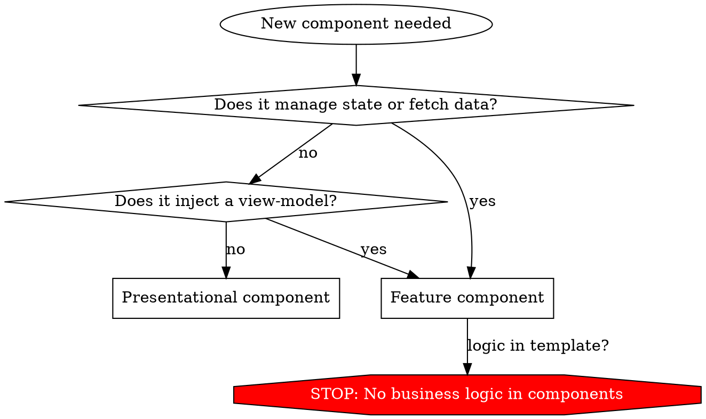

## Architecture

Every feature lives in its own directory under `src/app/features/`. Each feature is split into **presentation** (dumb components) and a **view-model** (state + logic).

```
src/app/
  features/
    recipes/
      recipes.routes.ts          # lazy-loaded routes for this feature
      recipe-list/
        recipe-list.component.ts # thin component, injects view-model
        recipe-list.vm.ts        # view-model: signals, computed, actions
      recipe-detail/
        recipe-detail.component.ts
        recipe-detail.vm.ts
  shared/
    ui/                          # reusable presentational components
    services/                    # cross-feature services
    models/                      # shared TypeScript types/interfaces
```

- Feature routes are lazy-loaded: `loadComponent: () => import('./features/recipes/recipes.routes').then(m => m.ROUTES)`
- Each feature directory is self-contained.
- `shared/` holds cross-cutting concerns only.

## Component types



### Feature components

Thin shell that instantiates a view-model. ~3 lines of class code. All state and logic lives in the view-model.

```typescript
@Component({
    selector: "app-recipe-list",
    changeDetection: ChangeDetectionStrategy.OnPush,
    providers: [RecipeListViewModel],
    template: `
        @if (vm.loading()) {
            <z-skeleton class="h-8 w-full" />
        } @else if (vm.error()) {
            <z-alert zType="destructive">{{ vm.error() }}</z-alert>
        } @else {
            @for (recipe of vm.recipes(); track recipe.id) {
                <z-card>
                    <z-card-header>
                        <z-card-title>{{ recipe.name }}</z-card-title>
                    </z-card-header>
                </z-card>
            }
        }
    `,
    imports: [
        ZardCardComponent,
        ZardCardHeaderComponent,
        ZardCardTitleComponent,
        ZardSkeletonComponent,
        ZardAlertComponent,
    ],
})
export class RecipeListComponent {
    protected readonly vm = inject(RecipeListViewModel);
}
```

View-models are provided at the component (or route) level — never `providedIn: 'root'`. The component class is ~3 lines. All state and logic lives in the view-model.

### Presentational (dumb) components

- Receive data via `input()`, emit events via `output()`.
- No direct HTTP calls, no business logic.
- Template-only concerns: layout, bindings, event forwarding.

```typescript
@Component({
    selector: "app-recipe-card",
    changeDetection: ChangeDetectionStrategy.OnPush,
    template: `
        <z-card class="cursor-pointer transition-shadow hover:shadow-lg">
            <z-card-header>
                <z-card-title>{{ recipe().name }}</z-card-title>
            </z-card-header>
            <z-card-content>
                <p class="text-sm text-gray-500">{{ recipe().description }}</p>
            </z-card-content>
        </z-card>
    `,
    imports: [
        ZardCardComponent,
        ZardCardHeaderComponent,
        ZardCardTitleComponent,
        ZardCardContentComponent,
    ],
})
export class RecipeCardComponent {
    readonly recipe = input.required<Recipe>();
    readonly selected = input(false);
    readonly deleted = output<string>();
}
```

## Decorator config

```typescript
@Component({
  selector: 'app-my-feature',
  changeDetection: ChangeDetectionStrategy.OnPush,
  imports: [/* Zard components, other standalone components */],
  providers: [MyFeatureViewModel],
  template: `...`,
})
```

- Always set `changeDetection: ChangeDetectionStrategy.OnPush`.
- Never set `standalone: true` (default in Angular 20+).
- Use inline `template` for all components. Only use `templateUrl` for very large templates (>80 lines).
- Use `styleUrl` or inline `styles` sparingly — prefer Tailwind utility classes.

## Inputs and outputs

- Use `input()` function, not `@Input()` decorator.
- Use `output()` function, not `@Output()` decorator.
- Use `input.required<T>()` for required inputs.
- Use `model()` for two-way binding.

```typescript
export class RecipeCardComponent {
    readonly recipe = input.required<Recipe>();
    readonly selected = input(false);
    readonly deleted = output<string>();
}
```

## Dependency injection

- Use `inject()` function, never constructor injection.
- Prefer `inject()` at the class field level for readability.

```typescript
export class MyComponent {
    private readonly vm = inject(MyViewModel);
    private readonly router = inject(Router);
}
```

## Host bindings

- Use the `host` object in `@Component`, never `@HostBinding`/`@HostListener`.
- Bind events with `host: { '(click)': 'onClick()' }`.

## Template rules

- Native control flow only: `@if`, `@for`, `@switch`. Never `*ngIf`, `*ngFor`.
- `@for` always uses `track` expression.
- Use `class` bindings over `ngClass`. Use `style` bindings over `ngStyle`.
- Keep template expressions simple — complex logic goes in the view-model or `computed()`.
- Do not assume globals like `new Date()` — inject `DateAdapter` or pass from view-model.

## Zard UI

Use [Zard UI](https://zardui.com) components. Installed locally via CLI (`npx zard-cli add <component>`).

### Import pattern

```typescript
import { ZardButtonComponent } from "@/shared/ui/button.component";
import {
    ZardCardComponent,
    ZardCardHeaderComponent,
    ZardCardTitleComponent,
} from "@/shared/ui/card.component";
```

The exact import path depends on where `zard-cli` places them (typically `src/shared/ui/`). Adjust to match actual file locations.

### Usage conventions

- Use attribute selectors: `<button z-button zType="outline">`, `<z-card>`, `<z-input>`.
- Pass variants as attributes: `zType`, `zSize`, `zShape`.
- Combine with Tailwind utility classes for spacing/layout: `<z-card class="mt-4 p-2">`.
- Use `zDisabled`, `zLoading` for interactive states.

### Common components reference

| Component | Selector           | Common attributes                                       |
| --------- | ------------------ | ------------------------------------------------------- |
| Button    | `button[z-button]` | `zType`, `zSize`, `zDisabled`, `zLoading`               |
| Input     | `input[z-input]`   | `zSize`, `zError`                                       |
| Card      | `z-card`           | `class` for styling                                     |
| Alert     | `z-alert`          | `zType`                                                 |
| Skeleton  | `z-skeleton`       | `class` for sizing                                      |
| Dialog    | `z-dialog`         | programmatic via service                                |
| Tabs      | `z-tabs`           | `z-tabs-list`, `z-tab-trigger`, `z-tab-content`         |
| Select    | `z-select`         | `z-select-trigger`, `z-select-content`, `z-select-item` |
| Badge     | `z-badge`          | `zType`, `zSize`                                        |

When in doubt about a component's API, fetch its docs page at `https://zardui.com/docs/components/<component-name>`.

## Styling

- Tailwind CSS 4 with utility classes.
- Design tokens are CSS custom properties (see `styles.css` for available variables: `--primary`, `--background`, `--foreground`, etc.).
- Use `class="..."` for static classes, `[class]="dynamicClass()"` for computed classes.
- Avoid custom CSS files — if you need reusable styles, extract to a component or use Tailwind `@apply` in the component's styles.

## What NOT to do

- No `@Input()`, `@Output()`, `@HostBinding`, `@HostListener` decorators.
- No `*ngIf`, `*ngFor`, `*ngSwitch` structural directives.
- No `ngClass`, `ngStyle` directives.
- No business logic in components — use a view-model.
- No `standalone: true` in decorators.
- No NgModules — standalone components only.
